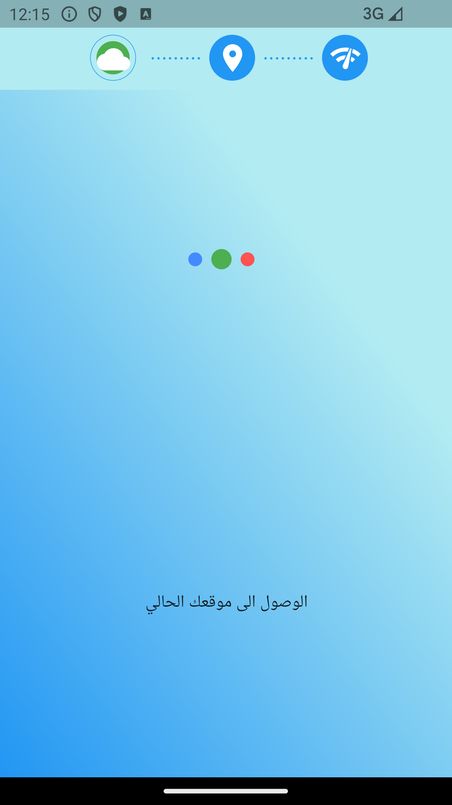
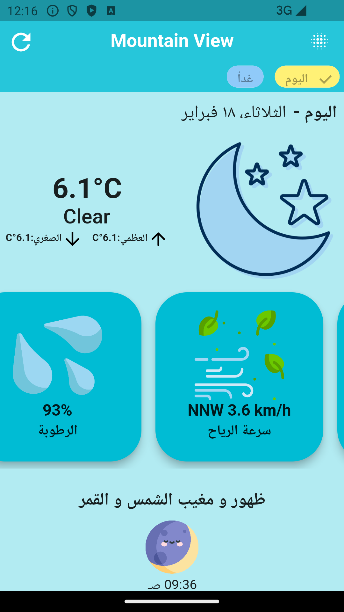
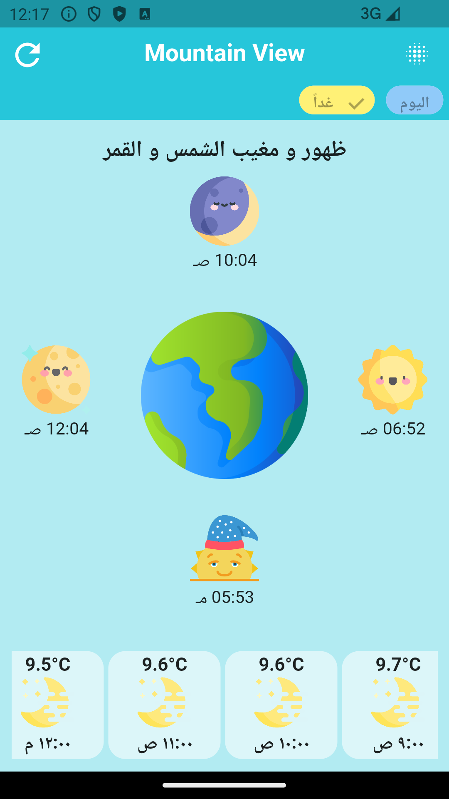
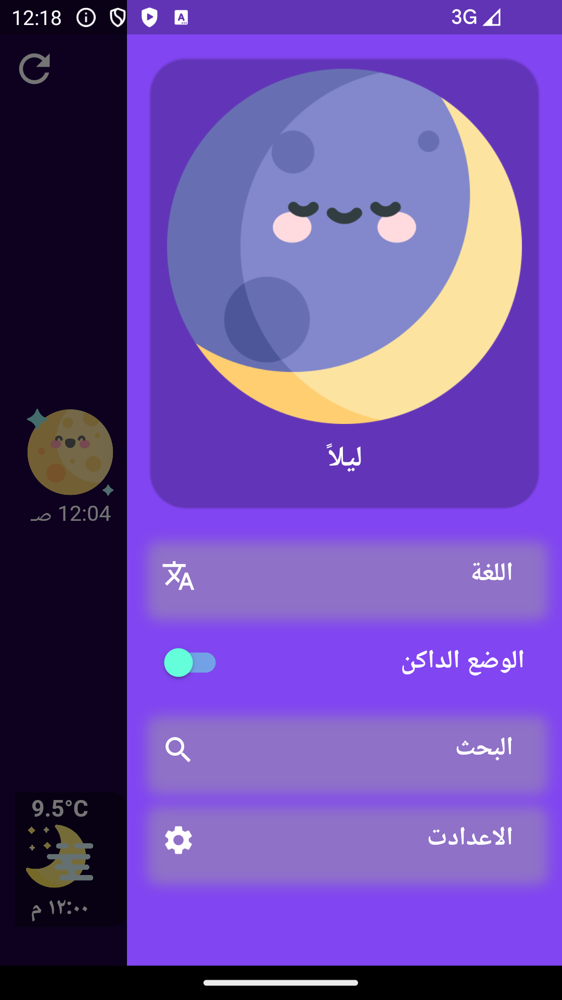
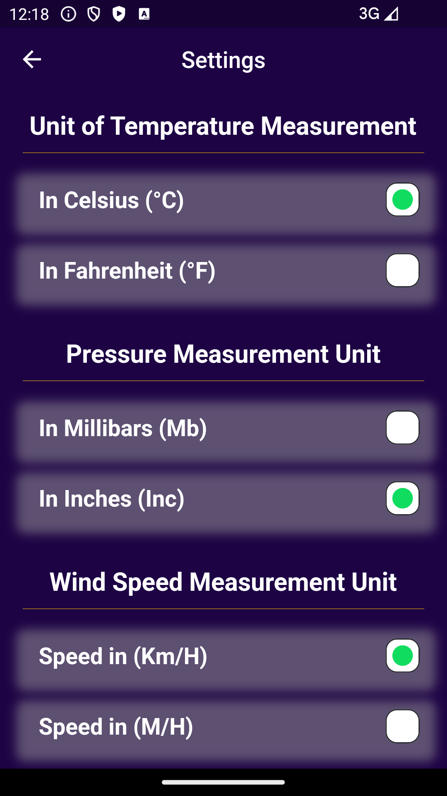
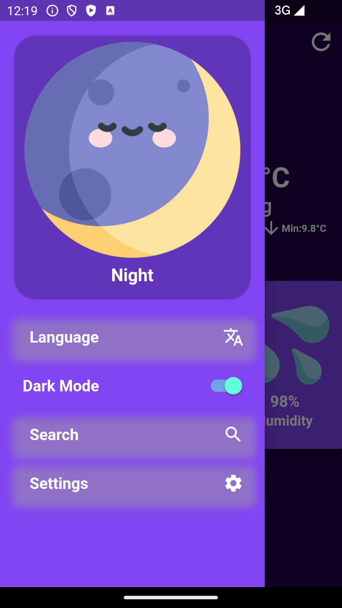
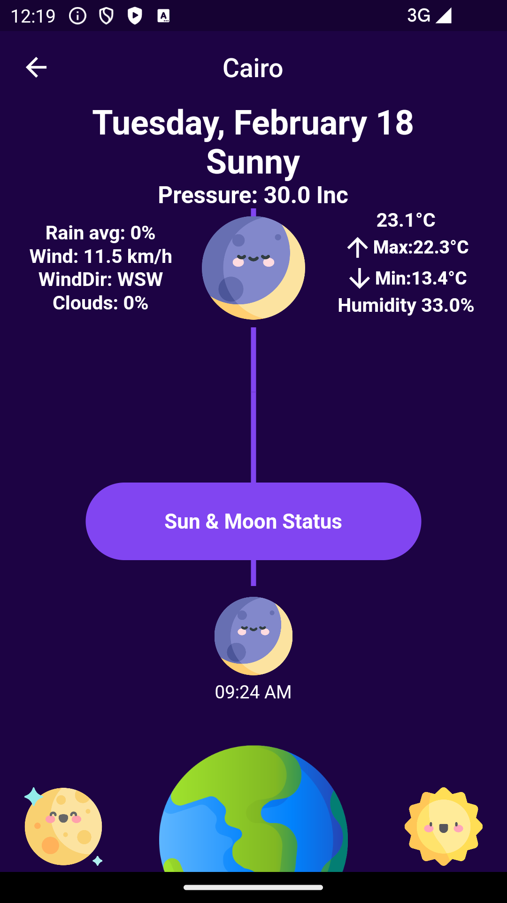
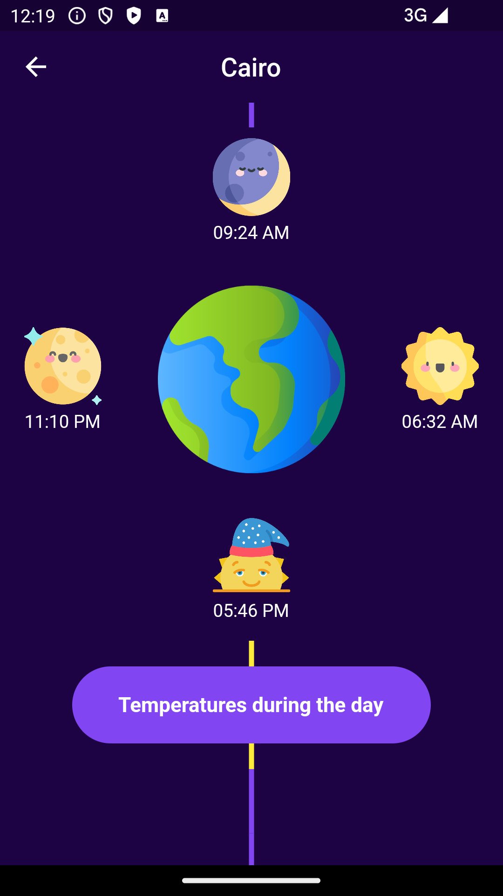

# 🌦️ Weather Application 🌦️

**Empowering you with up-to-the-minute weather insights!**

This meticulously crafted Flutter application is designed to deliver comprehensive and reliable weather information directly to your fingertips. 

## Project Description
🌍 This application harnesses the power of a trusted weather API to retrieve and present weather data with exceptional accuracy and clarity.  It offers a user-friendly and visually engaging experience. 
Users can effortlessly search for weather conditions in any city across the globe 🌐 and access a wealth of meteorological data, including precise temperature readings, humidity levels, wind speed, and detailed weather descriptions. Our unwavering commitment is to provide you with the most accurate and current weather information available, empowering you to plan your daily activities with utmost confidence and preparedness. ☀️🌧️

## Features

*   **Real-time Weather Updates** 📡: Obtain the most current weather conditions for any city worldwide, instantly. Stay informed and never be caught off guard!
*   **Comprehensive Meteorological Data** 📊: Delve into the specifics with detailed information, including exact temperature readings, relative humidity percentages, wind speed, and a concise yet thorough weather description.
*   **Global City Search Functionality** 🌎: Effortlessly search for weather data in any location, be it your hometown, a bustling metropolis, or a remote village. We've got the whole world covered!
*   **Intuitive and User-Centric Design** 🎨: Experience a clean, intuitive, and visually appealing interface designed for utmost ease of use. Navigating weather data has never been smoother!
*   **Adaptive Responsiveness**📱: This application is thoughtfully designed to support a multitude of screen sizes and device types, ensuring a seamless and consistent user experience across all platforms.
*   **Robust Error Handling** 🛠️: We've implemented sophisticated mechanisms to gracefully manage API and network errors, ensuring a smooth and reliable user experience, even under challenging network conditions.
* **Multiple language support** 🗣️: The app support various language for the users.
* **Customization Options** ⚙️: The user can customize how the weather information is display and change the unit of measurement.
* **Dark/Light mode** 🌓: Users can choose between the dark or light modes depending on their preferences.

## Screenshots 📸

- *Splash Screen* ⏳: An engaging splash screen displays during the application's startup phase. This screen diligently performs the critical tasks of verifying network connection status, acquiring the user's current location, and fetching real-time weather data for the user's current city.

   

- *Home Page - Weather Overview* 🏠: The main page presents a clear and concise overview of the current weather conditions in the selected city.

   

- *Home Page - Detailed Weather* 🌡️: A detailed view of the current weather information for the selected city.

   

- *home page it contains city weather information*

   

- *Drawer Menu - Settings and Customization* ⚙️:  A side drawer that grants users access to various settings and customization options, including the ability to toggle dark mode and select their preferred language.

   

- *Settings Page - Units Customization* 📏: Users can adjust their preferred unit of measurement for temperature, wind speed, and other weather-related metrics.

   <a href="url">e</a>

- *Drawer Menu - Language selection* 🌍: the application support a wide range of languages.

   

- *Search Result Page - City Weather* 🔍: The search result page provides a comprehensive display of the weather information for the city entered by the user.

   

- *Search Result Page - City Weather 🔎*: The search result page provides a comprehensive display of the weather information for the city entered by the user.

   

-*search result page it contains city weather information*

    
